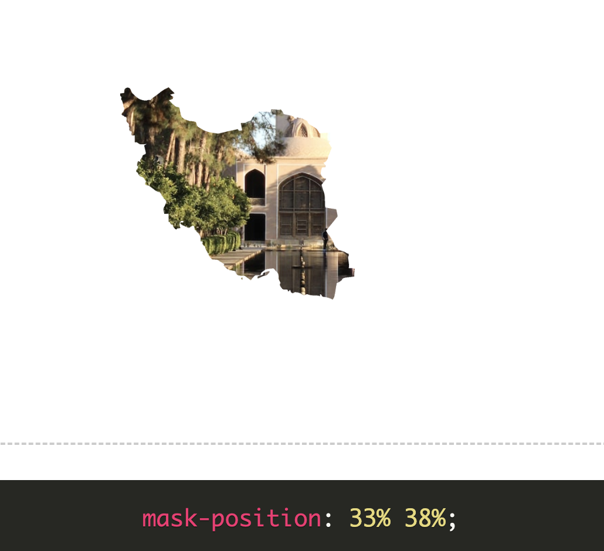

# The CSS mask property

Eindelijk, Photoshop komt ook deels naar CSS! Of althans het lijkt erop. Het is namelijk nu ook mogelijk om met CSS een afbeelding te masken. Dit maakt het mogelijk om delen van een afbeelding te verbergen of juist te tonen op basis van een maskerbeeld, je kan dus een afbeelding als het ware uitsnijden naar jouw wensen. Hoe dat precies zit en welke CSS-eigenschappen je hiervoor nodig hebt, leg ik verder uit in dit artikel.

## Hoe werkt het?

Er zijn twee verschillende manieren om een mask toe te passen. De een is om een afbeelding te maskeren met een andere afbeelding, zo leg je als het ware een sjabloon over een andere afbeelding. Dit werkt als volgt in CSS:

```
img {
  mask-image: url("/images/eva_logo.svg");
  mask-size: cover;
  mask-repeat: no-repeat;
  mask-position: center;
}
```

De andere manier is om een element te maskeren met een afbeelding. Zo kan je een logo bijvoorbeeld een kleur geven of eerst een patroon maken met CSS en dat in het logo zetten, de mogelijkheden zijn eindeloos.

```
div {
  max-width: 400px;
  aspect-ratio: 1;
  background-color: red;

  mask-image: url("/images/eva_logo.svg");
  mask-size: contain;
  mask-repeat: no-repeat;
  mask-position: center;
}
```

### Eigenschappen

De eigenschappen zijn vrijwel hetzelfde als die voor een background-image. Het zijn er een hoop, ik ga in dit artikel het vooral over de versies hebben die ondersteund worden, maar er zijn er ook een hoop die er nog aan gaan komen zoals bijvoorbeeld mask-border. De waardes zijn ook "short-hand" te declareren.

```
img {
  mask-clip: content-box;
  mask-composite: add;
  mask-image: url("/images/eva_logo.svg");
  mask-mode: alpha;
  mask-origin: border-box;
  mask-position: center;
  mask-repeat: no-repeat;
  mask-size: cover;
}
```

### Mask position

Dit is een van de meest interessante eigenschap al zeg ik het zelf. Het werkt vrijwel hetzelfde als het 'background-position' eigenschap en is ook een van de eigenschappen van "mask" die de meest verschillende vormen van waardes kan hebben. Zo is het mogelijk om het een waarde te geven in de vorm van een keyword, maar ook in de vorm van percentages, lengtes en het een globale waarde te geven. Daarnaast kan je ook nog al deze waardes animeren.

<p align="center">
	
</p>

### Meerdere waardes

Het is ook mogelijk om meerdere waardes toe te voegen voor de 'mask-image' en 'background-position'. Deze waardes kunnen door komma's gescheiden worden en zo worden meegegeven, de eerste waarde van de 'background-position' geld dan voor de eerste 'mask-image' en de tweede waarde de positie van de tweede afbeelding, enzovoort. Zo kan je uiteindelijk een heel eigen afbeelding als het ware creëren. 

```
div {
  mask-image: url("/images/eva_logo.svg"), url("/images/eva_logo2.svg"), url("/images/eva_logo3.svg");
  mask-position: 100px 10%, 0 right, center;
}
```

## Nadelen

Enkele nadelen kunnen zijn dat er geen alt-tekst op de afbeelding staat omdat het een masker is of dat het verwarrend wordt om een alt-tekst te schrijven die bij de afbeelding past, aangezien het als het ware een samensmelting is van twee verschillende afbeeldingen.

Verder kan het ook zo zijn dat het een afbeelding makkelijk onleesbaar maakt voor gebruikers met een visuele beperking. Je kan namelijk bijvoorbeeld (nog) geen border toevoegen aan een masker om dit probleem op te lossen en een achtergrond wordt ook lastig.

## Mogelijkheden

Eindeloos, maar om toch even wat voorbeelden te geven.

### Effecten

Als je je masker op-en-top wilt stijlen is het natuurlijk ook mogelijk om effecten toe te voegen aan je masker of filters. Zo kan je bijvoorbeeld schaduw toevoegen of makkelijk een "papercutout" uiterlijk creëren door het maskeren 3D te laten lijken. Je kan diepte creëren, knoppen verder stylen etc. Hierdoor kan je meer diepte en ruimtelijkheid aan je visuele interface meegeven met CSS.

### Animeren

Je kan in CSS de mask-position en mask-size eigenschappen animeren! Hierdoor kan je de positie van het mask op een element of andere afbeelding steeds aanpassen. Hierdoor zijn er veel mogelijkheden om uiteindelijk ook eventueel spelletjes te maken met dit CSS-eigenschap. Zo kan je ook bijvoorbeeld een mask op de muisaanwijzer van de gebruiker zetten. Voor mask-size geld hetzelfde, ook deze kan je animeren ket keyframes.

## Bronnen

- https://css-tricks.com/almanac/properties/m/mask-position/