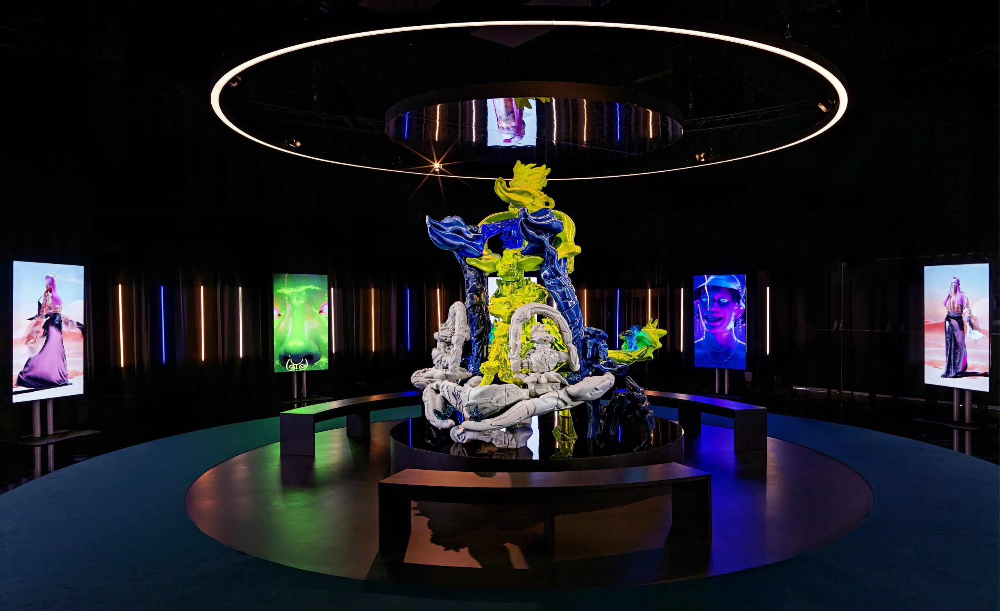
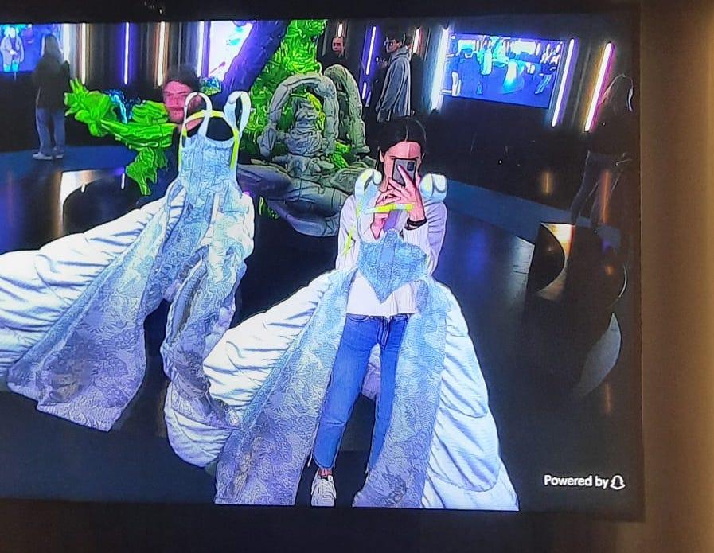

# NXT museum The Fabricant

> Whole-Land door Audrey Large

	

De tentoonstelling gaat over een buitenaardse boetiek en paskamer (WHOLELAND - Nxt Museum, 2023). In deze boetiek kan de bezoeker vrij rondlopen en naar 3D visuals van verschillende bewegende aliens kijken met buitenaardse kleding, maar ook zelf digitaal verschillende soorten kleding stukken passen. Zo kan je in realtime zien hoe een kledingstuk bij jou staat. Dit gebeurt door middel van grote schermen waaraan camera’s zijn verbonden die de ruimte als het ware “live” bekijken en dit streamen op de schermen. Als je voorbijloopt, zie je jezelf dan ook op het scherm met een kledingstuk aan.

## Analyse van het ontwerp

De tentoonstelling bestaat uit twee verschillende soorten installaties, het ene deel zijn schermen waarop 3D visuals worden afgespeeld op schermen met geluid, met deze visuals is geen interactie mogelijk. Het tweede soort installatie bestaat uit grote schermen met camera’s waarmee de gebruiker wel een interactie kan hebben, namelijk door zichzelf op de schermen te zien via en zo te bewegen. Het tweede soort installatie trekt bezoekers meer doordat er interactie mogelijk is. Je kan jezelf namelijk in een 3D kledingstuk zien en door te bewegen beweegt het kledingstuk mee. Dit maakt de installatie ook persoonlijker en spreekt het dus meer tot de gebruiker. Je ziet jezelf tenslotte in een kledingstuk en niet iemand anders. Het kledingstuk beweegt ook mee waardoor het de gebruiker aanspoort tot meer interactie zoals bijvoorbeeld heen en weer lopen of ronddraaien met het kledingstuk. Doordat het kledingstuk 3D is staat het toch wat dichter bij de realiteit dan een 2d kledingstuk en kan de gebruiker zichzelf wat meer “herkennen” in de installatie en dus de visual. Een interactieve spiegel even heel kort door de bocht.

## Technische analyse

Kwa techniek is de eerste installatie niet geheel ingewikkeld. Ze bestaan uit schermen waarop een video steeds opnieuw wordt afgespeeld door een loop. De 3D-animatie staat uiteraard full-screen en zo lijkt het net op een bewegend schilderij. DE tweede installatie aan de andere kant is zeer complex. Ten eerste is er een live-feed vanuit de camera bovenop het scherm en ten tweede is er een 3D object dat in augmented reality op de bezoeker wordt geplaatst. Wat mij opviel aan de schermen is dat er rechts onderin ‘powered by Snapchat’ stond. Dat maakte mijn onderzoek veel makkelijker. Het werkt als volgt:

1. Ten eerste wordt de live feed van de camera verwerkt door “computer vision” om zo een persoon te herkennen in 3D (Mathies, 2016). Computer vision maakt gebruik van pixel data vanuit de camera, dit soort applicaties kunnen mensen, objecten, gezichten en nog veel meer herkennen. Deze applicaties kijken naar de contrastwaarden van een pixel en weten dus dat het contrast tussen je neus en je wangen een bepaalde waarde heeft. Door al deze waarden samen te voegen weet de applicatie wat voor object het is.

2. Vervolgens is het belangrijk dat de kleding op de juiste plek zit. Dit wordt gedaan door artificiële intelligentie die getraind is om uiterlijke kenmerken te herkennen en te lokaliseren om deze vervolgens te bepalen waar deze zich in het beeld van de camera begeven.

3. Op basis van deze punten wordt er een mask gecreëerd die meebeweegt met het lichaam van de gebruiker terwijl de video data binnenkomt. Het mask schaalt en beweegt mee per frame.

4. De data hiervan wordt vervolgens steeds opgehaald (door middel van socket misschien?) verwerkt/gefilterd op de back-end om in de front-end de live feed van de video te laten zien met de toegevoegde data, namelijk het kledingstuk.

## Reflectie

Ik vind dat de tentoonstelling nieuwe kansen bied voor de mode-industrie door hun kledingstukken als het ware te laten ‘passen’ door gebruikers zonder dat ze het ooit aan hoeven te trekken. Maar ik vind het vooral interessant dat je als gebruiker zoveel interactie hebt met de applicatie en als het ware een beetje kan spelen ermee. Je kan rondjes draaien in je nieuwe jurk, er een foto van maken of het aan een vriend laten zien. Ik denk dat de live-feed vooral een interessante feature is voor toekomstige projecten en applicaties en ik zou er zelf zeker wel eens wat mee willen bouwen.

	

## Bronnen

- Mathies, D. (2016, 1 juli). The incredible underlying technology of Snapchat’s selfie lenses. Digital Trends. https://www.digitaltrends.com/photography/snapchat-selfie-lens-computer-vision-technology/
- WHOLELAND - Nxt Museum. (2023, 9 januari). Nxt Museum. https://nxtmuseum.com/nl/artist/wholeland-the-fabricant/