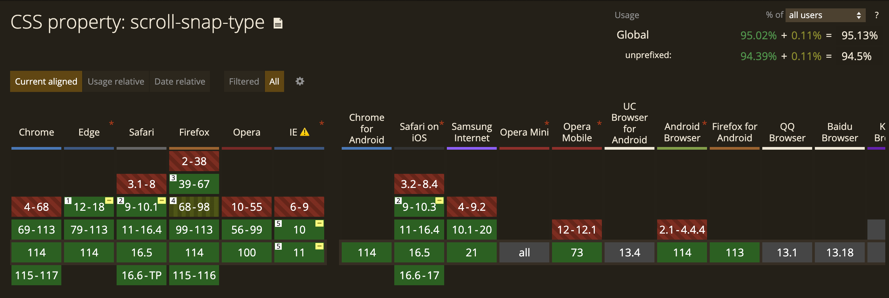

# CSS scroll-snap

In dit artikel ga ik het hebben over een van mijn favoriete CSS-technieken en dat is scroll-snap. Scroll-snap is weer echt een extra laag bovenop wat er al allemaal mogelijk is met CSS. Het biedt de mogelijkheid om het scroll-gedrag van de gebruiker te beheersen en de gebruikerservaring naar een hoger niveau te tillen. Zo maakt het je website nog interactiever.

## Hoe werkt het?

Scroll-Snap is een CSS-eigenschap die bepaalt hoe een scrollcontainer moet scrollen naar een specifieke positie terwijl de gebruiker door de inhoud scrolt. Hiermee kun je het scrollgedrag manipuleren en ervoor zorgen dat de gebruiker soepel door de inhoud navigeert, met duidelijke stops op bepaalde punten. Scroll-snap maakt het nu eindelijk mogelijk om een eigen carrousel of slideshow te maken zonder gebruik te maken van JavaScript.

Als gebruiker ervaar je als het ware een kleine animatie als je scrolt. Zodra je met je muis wilt scrollen naar bijvoorbeeld de volgende afbeelding merk je dat je maar een klein beetje hoeft te scrollen en je volgende afbeelding automatisch volledig, gecentreerd wordt weergegeven voor jouw neus.

## Eigenschappen

Voor het gebruik van scroll-snap snap werk je met twee HTML-elementen waarvan een de container is en de ander het element. De "parent" (container) wordt hierbij als het ware een "snap-container". Aan de parent geef je een 'scroll-snap-type:', deze bepaald welke richting de gebruiker op gaat scrollen en vanaf welk punt op het element de scroll "snapt" naar het volgende element. Je kan het element twee waardes meegeven, de eerste waarde bepaalde welke richting er op wordt gescrold en de tweede waarde bepaald vanaf wanneer er wordt "gesnapt" tijdens het scrollen. Deze waarde kan 'mandatory' zijn of 'proximity'. Mandatory zorgt dat het volgende element waar de gebruiker naartoe wilt scrollen minstens voor de helft in beeld moet zijn of gescrold moet zijn. Proximity geeft de gebruiker wat meer vrijheid en doet dit alleen als het volgende element grotendeels in beeld is (Kohler, 2020).
Verder kan je aan de parent ook een padding meegeven, deze zorgt voor een kleine ruimte tussen de randen van het "scroll-port" en het element.

```
.container {
  scroll-snap-type: y mandatory;
  scroll-padding: 2em;
}
```

Het element oftwel het kind van de parent,
Met de eigenschap 'scroll-snap-align' Het element oftewel het kind van de "parent", geef je een waarde mee van 'scroll-snap-align' hiermee kun je aangeven hoe het element moet uitlijnen ten opzichte van de snap-punten. Dit werkt hetzelfde als met flexbox. 'scroll-snap-align' heeft dan ook de waardes start, end, center en none.

```
.child {
  scroll-snap-align: center;
}
```

## Mogelijkheden

Een van de grootse mogelijkheden die 'scroll-snap' bied, is het maken van carrousels en slider zonder gebruikt te hoeven maken van JavaScript. Hierdoor is het mogelijk om puur alleen CSS te gebruiken. Dit maakt het makkelijker om progressive enhancement toe te kunnen passen op een applicatie doordat JavaScript als het ware heel makkelijk een CSS backup kan hebben. Verder wordt scroll-snap al ondersteund door de meeste browsers dus kan je het al implementeren (“scroll-snap” | Can I use. . . Support tables for HTML5, CSS3, etc, z.d.).

<p align="center">
	
</p>

## Bronnen

- Kohler, M. (2020, 18 juni). Practical CSS Scroll Snapping | CSS-Tricks. CSS-Tricks. https://css-tricks.com/practical-css-scroll-snapping/
- “scroll-snap” | Can I use. . . Support tables for HTML5, CSS3, etc. (z.d.). https://caniuse.com/?search=scroll-snap
