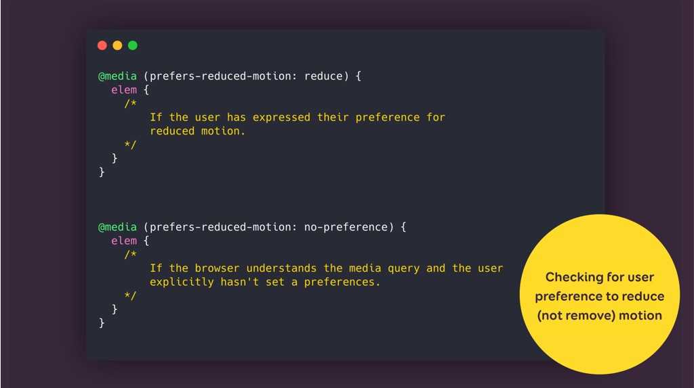

# Toegankelijke CSS-animaties

Animeren met CSS bied steeds meer mogelijkheden, waardoor websites en applicaties levendiger en interactiever worden. Door het groeiend aantal selectors binnen CSS wordt het animeren steeds makkelijker, een toffe animatie is zo gemaakt. Het lijkt tegenwoordig wel een trend om zoveel mogelijk animaties op je website te hebben. Maar er is ook een andere kant van dit verhaal, zo zijn niet alle animaties altijd even toegankelijk of ze maken de flow van de gehele website zelf ontoegankelijk. Terwijl het juist helemaal niet ingewikkeld is om animaties toegankelijk te maken. Daarom heb ik in dit artikel een aantal belangrijke technieken op een rijtje gezet.

## Geef je pseudo elementen context

De pseudo-elementen ::before en ::after worden vaak gebruikt in animaties om een extra element aan de animatie toe te voegen. Er wordt dan vaak een lege content-property of een afbeelding toegevoegd aan het element. Hoewel deze elementen op zichzelf vaak geen specifieke betekenis hebben, of toegevoegde waarde voor de content op de pagina, is dit niet altijd het geval. Zo kan bijvoorbeeld een afbeelding in een pseudo-element alsnog een toegevoegde waarde hebben voor de content op de pagina. Als dit het geval is is het essentieel dat er aan het content-property een alt-tekst wordt toegevoegd. Hierdoor kunnen ontwerpers beschrijvende tekst toevoegen die de betekenis en het doel van deze visuele elementen uitlegt. Dit helpt gebruikers, vooral degenen die afhankelijk zijn van screenreaders, om een beter begrip te krijgen van de visuele weergave van de pagina en de boodschap die de pseudo-elementen proberen over te brengen. Dit ziet er in de CSS dan als volgt uit:

```
.new::before {
 content: url(./img/star.png) / "New!";
}
```

## Reduceer beweging

CSS-animaties kunnen overweldigend of afleidend zijn. Voor sommig mensen met gezondheidsklachten kunnen animaties zelfs leiden tot gevolgen die variëren van misselijkheid tot epilepsie. Het is dus erg belangrijk om opties te bieden om de beweging te verminderen of zelfs volledig uit te schakelen voor de gebruiker. Door het gebruik van de CSS-mediaquery "prefers-reduced-motion" kunnen gebruikers met gevoeligheid voor beweging de animaties in een rustigere vorm ervaren of zelfs volledig uitschakelen als ze hier behoefte aan hebben. Dit kan worden geïmplementeerd met de volgende code:

```
@media (prefers-reduced-motion) {
  /* styles to apply if a user's device settings are set to reduced motion */
}
```

Het is belangrijk dat je de voorkeuren en instellingen van je gebruikers respecteert en dit kan vaak heel makkelijk door simpelweg gebruik te maken van van media-queries.

<p align="center">
	
</p>

## Scroll animaties

Veel CSS-animaties maken gebruik van scrollen om animaties te laten afspelen. Helaas kunnen sommige gebruikers, met bijvoorbeeld motorische beperkingen, moeite hebben met het navigeren door pagina's met scrollen, vooral als de animatie de scrollpositie beïnvloedt. Om animaties ook voor deze groep gebruikers toegankelijk te maken kan je native-scrolling uitschakelen wanneer de animatie plaatsvindt en de gebruiker gebruik laten maken van aangepaste navigatie- of besturingsmogelijkheden. Zoals bijvoorbeeld tab.  Hierdoor kan ook deze groep gebruikers de animatie ervaren zonder te worstelen met het scrollen.

## Bronnen

- https://drafts.csswg.org/css-content-3/#alt
- https://webdesign.tutsplus.com/tutorials/a-guide-to-creating-accessible-animations--cms-32038
- https://css-tricks.com/accessible-web-animation-the-wcag-on-animation-explained/
- https://stephaniewalter.design/blog/enhancing-user-experience-with-css-animations/